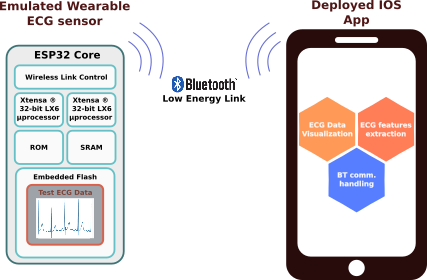
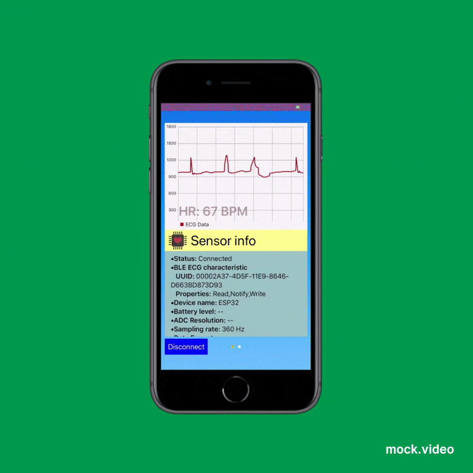

______

Deployment of an Arduino-based emulated Electrocardiogram (ECG) sensor and an IOS application for real time ECG data visualization and processing. This could serve as the bare bones for your cool ECG measurement, transmission and processing applications!

## General system overview

    <!--img src="ecgMonitorFigs/schematic.png" width="427" height="280" -->
    

## App UI and performance demo

    <!--img src="ecgMonitorFigs/screenshot.gif" width="400" height="400" /-->
    

______
## Wearable sensor characteristics
- Hardware infrastructure based on the [ESP32 Wi-Fi+BLE](https://www.espressif.com/en/products/hardware/esp32/overview) module from Espressif Systems. 
- Full Arduino implementation. 
- Ardiuno Libraries used:
  - [On-board flash memory write/read library](https://github.com/espressif/arduino-esp32/tree/master/libraries/SPIFFS) (SPIFFS.h)
  - [Espressif Bluetooth stack libraries](https://github.com/espressif/arduino-esp32/tree/master/libraries/BLE) (BLEDevice.h, BLEServer.h, BLEUtils.h)
  
## Mobile IOS application characteristics
- Single view intuitive UI implemented on Swift 5.
- Real time ECG features extraction and visualization.
- Frameworks used: 
  - UIKit
  - [Charts](https://github.com/danielgindi/Charts) v. 3.3.0
  - Core Bluetooth
  - simd

ECG records from the [MIT-BIH arrhythmia database](https://physionet.org/content/mitdb/1.0.0/) are used as the source of ECG data, and they are stored in the ESP32 on-board flash memory. In my testings I used the ESP32-WROOM-32D device with 4MB of flash memory. It was necessary to compress the ECG data to be able to fit it into the ESP32 device. A custom compression/decompression routine is used in the provided Python and Arduino sources to reduce the size of the 30 minutes ECG files to around 0.975 MB.  

The Arduino sketch could be easily modified to enable ECG measurements with the ESP32 ADC converter or a more accurate one.

The detection of the QRS complexes in the ECG time series is achieved with the Curve Lenght Transform algorithm proposed by Zong et all 1. A custom Swift class, 'QRSdetector.swift' contains the functions and variables used for the implementation of the algorithm and array structures that hold useful information such as low-pass filtered ECG samples, historic R-R interval and heartrate measurements as well. However, the implementation of an adaptive thresholding method such as stated on the original paper is still pending. 

______

<!--## Installation guide-->

> [1] Zong, W., et al. “A Robust Open-Source Algorithm to Detect Onset and Duration of QRS Complexes.” Computers in Cardiology, 2003, doi:10.1109/cic.2003.1291261.
